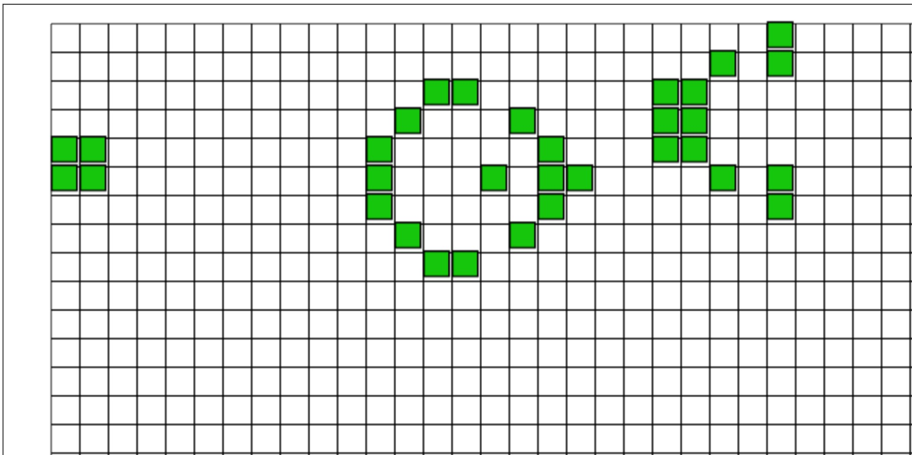

# Game of Life – Java-Projekt

Dies ist eine objektorientierte Umsetzung von **Conway's Game of Life** in Java.  
Es handelt sich um ein Zell-Automaten-Simulationsspiel, das Zellgenerationen auf einem Grid visualisiert – basierend auf festen Regeln für Geburt, Überleben und Tod.

## 🔍 Projektziel

Das Ziel dieses Projekts war es, meine Fähigkeiten in **Java**, **OOP (Objektorientierte Programmierung)** sowie der **grafischen Darstellung in einer LiveView-Programmierumgebung** zu vertiefen.  
Es wurde von mir selbst implementiert und dokumentiert.

## ⚙️ Features

- Darstellung eines dynamischen Zellgitters
- Initiale Konfiguration der Zellen durch Nutzerinteraktion
- Visualisierung der Generationen in Echtzeit
- Sauber strukturierter Java-Code mit Fokus auf Lesbarkeit & Wiederverwendbarkeit

## 💡 Technologien

- Java (SE)
- Objektorientierte Programmierung
- LiveView-Umgebung mit Turtle

## 📸 Vorschau

## 📁 Projektstruktur

- `GoL.java` – Logik des Spielfelds, Einzelne Zellen und Regeln sowie Benutzeroberfläche 

## 🙋🏽‍♀️ Über mich

Ich bin Informatik-Studentin im dritten Semester mit Begeisterung für Softwareentwicklung und praktisches Lernen durch Projekte.  
Dieses Projekt war Teil meines Lernvorgangs, um Java besser zu verstehen und anzuwenden.

[➡️ GitHub-Profil ansehen](https://github.com/DanielleKami)

---
